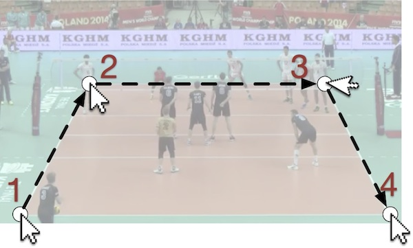

# Draw a grid on HTML5 Video Streaming

This is a tool to draw a grid over an HTML5 video, to analyze visual data inside the video through the grid that is superimposed over the video.

This small utility has been created as an additional functionality for a real-time (and deferred) gameplay analysis project in volleyball. It allows to know, through the grid the position of the players and other aspects. You can see the coordinates of each player using the intersection of the grid axes.

This is a visual aid for detecting play in volleyball (or virtually for another sport or any video type supported by HTML5).

Use:

The gridovideo function needs 4 points to draw the grid, the order is `left-down` ->` left-up` -> `right-up` ->` right-down`, like the following scheme:

